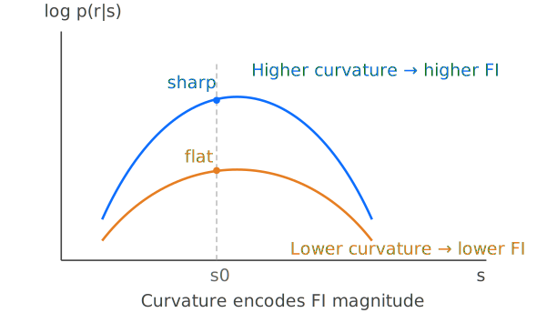
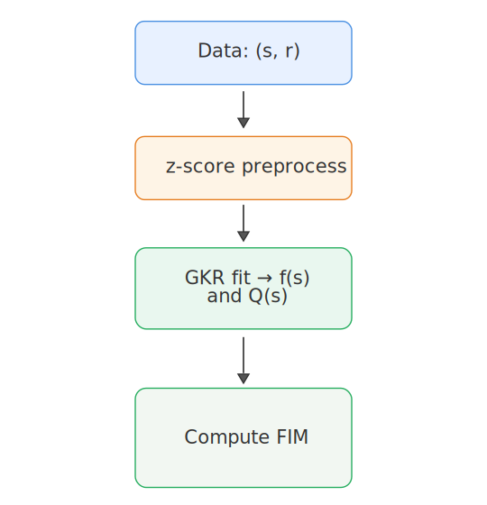

# 
 Fisher Information in Neuroscience 

---
# 1. Background & Motivation: Why Compute Fisher Information?

## 1.1 How precisely can a neural population encode stimuli or behavioral variables?
Given stimulus/behavioral variables (stimulus) $\mathbf{s}$ (e.g., position $(x,y)$, direction $\theta$, speed $v$), we record neural population responses $\mathbf{r}\in\mathbb{R}^N$ (e.g., spike counts or firing rates in a time window).

We care about:
- Decode stimuli from responses
- Theoretical precision limit
- State-dependent precision changes

### 1.2 What can Fisher Information Tell Us ?
**No need to specify a decoder**, yet it provides the error lower bound for any unbiased estimator **(Cramér–Rao bound)**.

- **1D parameter:**
  $$\mathrm{Var}(\hat{s}) \ge \frac{1}{I(s)}$$
- **Multi-dimensional parameter:**
  $$\mathrm{Cov}(\hat{\mathbf{s}}) \succeq \mathcal{I}(\mathbf{s})^{-1}$$

FI/FIM is widely used to:
- Compare encoding across populations or states
- Assess impact of noise correlations
- Link sensitivity to noise structure

---

# 2. Definition of Fisher Information 

## 2.1 Basic situation: 1D Stimulus & Single Neuron
Let $s$ be the stimulus parameter, $r$ be the neural response, and $p(r|s)$ be the conditional probability distribution.

**Fisher Information (FI)** is defined as:
$$
I(s)=\mathbb{E}\left[\left(\frac{\partial}{\partial s}\log p(r|s)\right)^2\right]
$$

Under regularity conditions, this is equivalent to:
$$
I(s)= -\mathbb{E}\left[\frac{\partial^2}{\partial s^2}\log p(r|s)\right]
$$

### Intuitive Understanding 
- **"Sharpness" of the likelihood curve:** The larger the curvature of $\log p(r|s)$ w.r.t. $s$, the easier it is to localize $s$, and thus FI is larger.

### Example: Poisson Neuron 
If spike count $r\sim\mathrm{Poisson}(f(s))$ , where $f(s)$ is the tuning curve (mean firing rate), then:
$$
I(s)=\frac{[f'(s)]^2}{f(s)}
$$

**Derivation:**

For a Poisson distribution, the probability mass function is:
$$p(r|s) = \frac{f(s)^r e^{-f(s)}}{r!}$$

Taking the logarithm:
$$\log p(r|s) = r\log f(s) - f(s) - \log(r!)$$

Taking the derivative with respect to $s$:
$$\frac{\partial}{\partial s}\log p(r|s) = r\frac{f'(s)}{f(s)} - f'(s) = f'(s)\left(\frac{r}{f(s)} - 1\right)$$

Squaring:
$$\left(\frac{\partial}{\partial s}\log p(r|s)\right)^2 = [f'(s)]^2\left(\frac{r}{f(s)} - 1\right)^2$$

Taking the expectation over $r$ (where $r\sim\mathrm{Poisson}(f(s))$):
$$I(s) = [f'(s)]^2 \mathbb{E}_r\left[\left(\frac{r}{f(s)} - 1\right)^2\right]$$

Expanding:
$$I(s) = [f'(s)]^2 \left[\frac{\mathbb{E}[r^2]}{f(s)^2} - \frac{2\mathbb{E}[r]}{f(s)} + 1\right]$$

For Poisson distribution: $\mathbb{E}[r] = f(s)$ and $\mathbb{E}[r^2] = f(s) + f(s)^2$

Substituting:
$$I(s) = [f'(s)]^2 \left[\frac{f(s) + f(s)^2}{f(s)^2} - \frac{2f(s)}{f(s)} + 1\right]$$

$$= [f'(s)]^2 \left[\frac{1}{f(s)} + 1 - 2 + 1\right]$$

$$= \frac{[f'(s)]^2}{f(s)}$$

**Intuition**
- Larger $f'(s)$  → small changes are more distinguishable → higher information
- Larger $f(s)$ means Poisson variance is also large (variance = mean) → reduces precision

---

## 2.2 Multi-dimensional Stimulus & Neural population
When the stimulus is a $k$-dimensional vector $\mathbf{s}=(s_1,\dots,s_k)^T$ and the observation is an $N$-dimensional population response $\mathbf{r}$.

#### Fisher Information Matrix (FIM):
$$
\mathcal{I}_{ij}(\mathbf{s})=\mathbb{E}\left[\frac{\partial}{\partial s_i}\log p(\mathbf{r}|\mathbf{s})\cdot\frac{\partial}{\partial s_j}\log p(\mathbf{r}|\mathbf{s})\right]
$$

This yields a $k\times k$ matrix $\mathcal{I}(\mathbf{s})$.

#### Intuition:
- Diagonal elements represent the amount of information about each individual stimulus parameter.
- Off-diagonal elements capture how changes in one parameter affect the information about another, reflecting parameter interactions.

---

## 2.3 Closed-Form FIM Under Gaussian Assumption
To incorporate noise correlations, neuroscience commonly uses Gaussian approximation:

**Assume:**
$$
\mathbf{r}|\mathbf{s}\sim \mathcal{N}\big(\mathbf{f}(\mathbf{s}),\, Q(\mathbf{s})\big)
$$

where:
- $\mathbf{f}(\mathbf{s})\in\mathbb{R}^N$: Mean response vector (population tuning curve)
- $Q(\mathbf{s})\in\mathbb{R}^{N\times N}$: Covariance matrix (noise correlations)

**Define the Jacobian matrix** as:
$$
J(\mathbf{s}) = \frac{\partial \mathbf{f}(\mathbf{s})}{\partial \mathbf{s}}\in\mathbb{R}^{N\times k}
$$

The **general Gaussian FIM** is:

$$\mathcal{I}(\mathbf{s}) = J(\mathbf{s})^T Q(\mathbf{s})^{-1} J(\mathbf{s}) + \frac{1}{2}\,\mathrm{Tr}\left[Q^{-1}\frac{\partial Q}{\partial s_i}Q^{-1}\frac{\partial Q}{\partial s_j}\right]_{ij}$$

**Derivation:**

For a multivariate Gaussian distribution, the probability density is:
$$p(\mathbf{r}|\mathbf{s}) = \frac{1}{(2\pi)^{N/2}|Q(\mathbf{s})|^{1/2}} \exp\left(-\frac{1}{2}[\mathbf{r}-\mathbf{f}(\mathbf{s})]^T Q(\mathbf{s})^{-1}[\mathbf{r}-\mathbf{f}(\mathbf{s})]\right)$$

Taking the logarithm:
$$\log p(\mathbf{r}|\mathbf{s}) = -\frac{N}{2}\log(2\pi) - \frac{1}{2}\log|Q(\mathbf{s})| - \frac{1}{2}[\mathbf{r}-\mathbf{f}(\mathbf{s})]^T Q(\mathbf{s})^{-1}[\mathbf{r}-\mathbf{f}(\mathbf{s})]$$

Taking the partial derivative with respect to $s_i$:
$$\frac{\partial}{\partial s_i}\log p(\mathbf{r}|\mathbf{s}) = -\frac{1}{2}\frac{\partial}{\partial s_i}\log|Q| - \frac{1}{2}\frac{\partial}{\partial s_i}\left[(\mathbf{r}-\mathbf{f})^T Q^{-1}(\mathbf{r}-\mathbf{f})\right]$$

Using the identities:
- $\frac{\partial}{\partial s_i}\log|Q| = \mathrm{Tr}\left[Q^{-1}\frac{\partial Q}{\partial s_i}\right]$
- $\frac{\partial \mathbf{f}}{\partial s_i} = J_i$ (the $i$-th column of Jacobian $J$)

For the quadratic form, applying the chain rule:
$$\frac{\partial}{\partial s_i}\left[(\mathbf{r}-\mathbf{f})^T Q^{-1}(\mathbf{r}-\mathbf{f})\right] = -2J_i^T Q^{-1}(\mathbf{r}-\mathbf{f}) + (\mathbf{r}-\mathbf{f})^T \frac{\partial Q^{-1}}{\partial s_i}(\mathbf{r}-\mathbf{f})$$

Using $\frac{\partial Q^{-1}}{\partial s_i} = -Q^{-1}\frac{\partial Q}{\partial s_i}Q^{-1}$, we get:
$$\frac{\partial}{\partial s_i}\log p(\mathbf{r}|\mathbf{s}) = J_i^T Q^{-1}(\mathbf{r}-\mathbf{f}) - \frac{1}{2}\mathrm{Tr}\left[Q^{-1}\frac{\partial Q}{\partial s_i}\right] - \frac{1}{2}(\mathbf{r}-\mathbf{f})^T Q^{-1}\frac{\partial Q}{\partial s_i}Q^{-1}(\mathbf{r}-\mathbf{f})$$

The Fisher Information Matrix element is:
$$\mathcal{I}_{ij} = \mathbb{E}\left[\frac{\partial \log p}{\partial s_i} \cdot \frac{\partial \log p}{\partial s_j}\right]$$

After expanding the product and taking expectations (noting that $\mathbb{E}[\mathbf{r}-\mathbf{f}] = \mathbf{0}$ and $\mathbb{E}[(\mathbf{r}-\mathbf{f})(\mathbf{r}-\mathbf{f})^T] = Q$):

**First term (from mean):**
$$\mathbb{E}\left[J_i^T Q^{-1}(\mathbf{r}-\mathbf{f})(\mathbf{r}-\mathbf{f})^T Q^{-1}J_j\right] = J_i^T Q^{-1} Q Q^{-1}J_j = J_i^T Q^{-1}J_j$$

Summing over all $i,j$ gives: $J^T Q^{-1} J$

**Second term (from covariance):**
Using properties of Gaussian moments and trace operations:
$$\frac{1}{2}\mathrm{Tr}\left[Q^{-1}\frac{\partial Q}{\partial s_i}Q^{-1}\frac{\partial Q}{\partial s_j}\right]$$

Combining both terms yields the complete formula.

**Common Simplification**: If we assume $Q$ is stimulus-invariant, i.e., $Q(\mathbf{s})\approx Q$, the second term vanishes:

$$
\mathcal{I}(\mathbf{s}) = J(\mathbf{s})^T Q^{-1} J(\mathbf{s})
$$

**Dimension Check:**
- $Q^{-1}$ is $(N\times N)$
- $J$ is $(N\times k)$
- $\mathcal{I}(\mathbf{s})$ is $(k\times k)$ 

> **Special case:** For 1D parameter ($k=1$), $J(\mathbf{s})$ becomes the vector $\mathbf{f}'(s)\in\mathbb{R}^N$, and we get a scalar:
> $$I(s)=\mathbf{f}'(s)^T Q^{-1}\mathbf{f}'(s)$$

---

# 3. General Pipeline for Computing FIM from Neural Data

If we have $J(\mathbf{s})$ and $Q(\mathbf{s})$ from data, then we can compute Fisher Information Matrix as:
$$\mathcal{I}(\mathbf{s}) = J(\mathbf{s})^T Q(\mathbf{s})^{-1} J(\mathbf{s})$$

## 3.1 Data Requirements

**Condition A. Discrete Stimulus & Multiple Repeats**
- Present multiple discrete stimulus points $\{\mathbf{s}_g\}$ (e.g., grid positions)
- Repeat each condition many times, collecting response samples $\mathbf{r}$ ∈ $\mathbb{R}^{N\times samples}$

**Condition B. Continuous Behavioral Trajectories**
- Animal moves freely; $\mathbf{s}(t)=(x(t),y(t),v(t),\dots)$ varies continuously
- Record time-varying neural population responses $\mathbf{r}(t)$ ∈ $\mathbb{R}^{N\times T}$

---

## 3.2 Estimating Mean Tuning Curve $\mathbf{f}(\mathbf{s})$ and Jacobian $J(\mathbf{s})$

Under the Gaussian approximation, the key is obtaining $J(\mathbf{s})=\partial\mathbf{f}/\partial\mathbf{s}$.

**Straightforward Approach: Local Linear Regression**
- At each target point $\mathbf{s}_0$, fit a weighted linear regression using nearby samples
- Weights: $w_i = \exp\left(-\frac{\|\mathbf{s}_i-\mathbf{s}_0\|^2}{2h^2}\right)$
- The regression slopes give the local Jacobian $J(\mathbf{s}_0)$

---

## 3.3 Estimating Noise Covariance $Q$

Assuming stimulus-invariant covariance $Q(\mathbf{s})\approx Q$, we can:
1. Compute residuals:
   $$\boldsymbol\epsilon_i=\mathbf{r}_i - \hat{\mathbf{f}}(\mathbf{s}_i)$$
2. Pool all residuals and estimate covariance:
   $$\hat{Q}=\mathrm{Cov}(\boldsymbol\epsilon)$$

**Numerical Issues:** $\hat{Q}$ may be singular/ill-conditioned → apply regularization: $Q_{\mathrm{reg}}=\hat{Q}+\lambda I$

---

## 3.4 Computing FIM and Summary Metrics
For each stimulus point $\mathbf{s}_g$:
- We have $J_g\in\mathbb{R}^{N\times k}$ and $Q_{\mathrm{reg}}\in\mathbb{R}^{N\times N}$
- Compute: $$\mathcal{I}(\mathbf{s}_g)=J_g^T Q_{\mathrm{reg}}^{-1}J_g$$

**Summary Metrics** :
- $\det(\mathcal{I})$
- $\mathrm{trace}(\mathcal{I})$
- Eigenvalues $\lambda_i$
- Condition number $\kappa=\lambda_{\max}/\lambda_{\min}$

---

# 4. Advanced: Gaussian Kernel Regression (GKR) for FIM Estimation

## 4.1 Limitations of Traditional Pipeline

- Requires Massive Repeated Measurements

- $Q$ May Be Stimulus-Dependent But Ignored

- Local Derivative Estimation Is Sensitive

---

## 4.2 Key Idea: Smoothly Fit Mean & Covariance
If we can learn from data:
- A **continuous mean function $\mathbf{f}(\mathbf{s})$**
- A **continuous covariance function $Q(\mathbf{s})$**

Then we can compute at any query point:
$$\mathcal{I}(\mathbf{s}) = J(\mathbf{s})^T Q(\mathbf{s})^{-1} J(\mathbf{s})$$

---

## 4.3 Gaussian Kernel Regression (GKR) Framework

Genrally, GKR consists of 2 steps to estimate:

1. A smooth **mean manifold** (population tuning) $\mathbf{f}(\mathbf{s}) = \mathbb{E}[\mathbf{r}\mid\mathbf{s}] \in \mathbb{R}^N$
2. A smooth **noise covariance field** $Q(\mathbf{s}) = \mathrm{Cov}(\mathbf{r}-\mathbf{f}(\mathbf{s})\mid\mathbf{s}) \in \mathbb{R}^{N\times N}$

Once both are available, Fisher information can be computed at any query point via:
$$
\mathcal{I}(\mathbf{s}) = J(\mathbf{s})^T Q(\mathbf{s})^{-1} J(\mathbf{s}),\qquad
J(\mathbf{s}) = \frac{\partial \mathbf{f}(\mathbf{s})}{\partial \mathbf{s}}.
$$

  

---

### 4.3.1 Data Setup
Assume that we observe time-indexed samples $\{(\mathbf{s}_t, \mathbf{r}_t)\}_{t=1}^T$ where:

- $\mathbf{s}_t\in\mathbb{R}^k$ is the stimulus label (e.g., $k=3$ for $(x,y,v)$)
- $\mathbf{r}_t\in\mathbb{R}^N$ is the population response at the same time (e.g., firing rates of $N$ neurons)

**Standardization**
Apply z-score standardization to $\mathbf{r}$ before regression. This prevents high-firing neurons from dominating the regression.

---

### 4.3.2 Step 1 — Fit the Mean Manifold with Gaussian Process Regression
For each neuron $j$, assume a **Gaussian Process (GP)** prior over a latent function $f_j(\mathbf{s})$:
$$
\qquad r_{t,j} = f_j(\mathbf{s}_t) + \epsilon_{t,j},\ \epsilon_{t,j}\sim\mathcal{N}(0,\beta^{-1})\quad
\text{with}\quad
f_j(\mathbf{s}) \sim \nobreak\mathcal{GP}(0,\, k(\mathbf{s},\mathbf{s}'))
$$

**Kernel design:** A kernel $k(\mathbf{s},\mathbf{s}')$ defines similarity between stimulus states. Typically,
$$
k(\mathbf{s},\mathbf{s}')
= \Big(\prod_{d=1}^k k_d(s_d,s'_d)\Big) + c + \sigma^2 \delta_{\mathbf{s},\mathbf{s}'}.
$$
For example:

- For continuous variables (e.g., speed), use a Squared Exponential kernel (e.g., $k_d(s_d,s'_d)=\exp(-\frac{(s_d-s'_d)^2}{2\ell_d^2})$)

**GP predition**
Once the kernel is specified, we can predict the expected responses **$r_j(\mathbf{s}_*)$** for a given $\mathbf{s}_*$ using the following formula:
$$r_j(\mathbf{s}_*) = \mathbf{k}_*^T (K + \beta^{-1} I)^{-1} \mathbf{r}_j,$$
where:
- $\mathbf{k}_*$ defines the kernel vector between the test point $\mathbf{s}_*$ and training points: $[\mathbf{k}_*]_t = k(\mathbf{s}_*, \mathbf{s}_t)$
- $K$ is the kernel matrix over training points: $[K]_{tt'} = k(\mathbf{s}_t, \mathbf{s}_{t'})$

**Intuition of the above formula**
- For a test point $\mathbf{s}_*$, the predicted mean response is a weighted sum of observed responses $\mathbf{r}_j$. The weights depend on the similarity between $\mathbf{s}_*$ and training points, adjusted by noise level $\beta^{-1}$.

**Derivation of the above formula**
- This formula arises from the properties of multivariate Gaussian distributions and conditioning.
- Key mathematical theorem: If $\begin{pmatrix} \mathbf{y} \\ \mathbf{y}_* \end{pmatrix} \sim \mathcal{N}\left(0, \begin{pmatrix} K & K_*^T \\ K_* & K_{**} \end{pmatrix}\right)$, then the conditional distribution $\mathbf{y}_*|\mathbf{y}$  ~ $\mathcal{N}(K_* K^{-1} \mathbf{y}, K_{**} - K_* K^{-1} K_*^T)$.
- Here, $\mathbf{y}$ corresponds to training outputs $\mathbf{r}_j$, and $\mathbf{y}_*$ corresponds to the test output $r_j(\mathbf{s}_*)$.

**Learnable hyperparameters**
Hyperparameters (length scales $\ell_d$, constant $c$, etc.) could be learned by maximizing the negative log marginal likelihood.

**Derivation of the loss function**

Given stimulus labels $\mathbf{S}$ and hyperparameters $\boldsymbol{\theta}$, the observed responses for neuron $j$ are $\mathbf{y} = [r_{1,j}, r_{2,j}, \ldots, r_{T,j}]^T$.

Our goal is to maximize the marginal likelihood of the observed data $\mathbf{y}$ given $\mathbf{S}$ and $\boldsymbol{\theta}$:

$$p(\mathbf{y} \mid \mathbf{X}, \boldsymbol{\theta}) = \int p(\mathbf{y} \mid \mathbf{f}) \, p(\mathbf{f} \mid \mathbf{X}, \boldsymbol{\theta}) \, d\mathbf{f}$$

Since both $p(\mathbf{f} \mid \mathbf{X}, \boldsymbol{\theta}) = \mathcal{N}(\mathbf{0}, K)$ and $p(\mathbf{y} \mid \mathbf{f}) = \mathcal{N}(\mathbf{f}, \beta^{-1}I)$ are Gaussian, the marginal is also Gaussian:

$$\mathbf{y} \mid \mathbf{X}, \boldsymbol{\theta} \sim \mathcal{N}(\mathbf{0}, K_y), \quad \text{where } K_y = K + \beta^{-1}I$$

So the marginal likelihood is:

$$p(\mathbf{y} \mid \mathbf{X}, \boldsymbol{\theta}) = \frac{1}{(2\pi)^{T/2} |K_y|^{1/2}} \exp\left(-\frac{1}{2} \mathbf{y}^T K_y^{-1} \mathbf{y}\right)$$

Taking the logarithm gives:

$$\log p(\mathbf{y} \mid \mathbf{X}, \boldsymbol{\theta}) = -\frac{T}{2}\log(2\pi) - \frac{1}{2}\log|K_y| - \frac{1}{2}\mathbf{y}^T K_y^{-1} \mathbf{y}$$

To find optimal hyperparameters, we **minimize** the negative log marginal likelihood:

$$\mathcal{L}(\boldsymbol{\theta}) = -\log p(\mathbf{y} \mid \mathbf{X}, \boldsymbol{\theta}) = \frac{1}{2}\log|K_y| + \frac{1}{2}\mathbf{y}^T K_y^{-1} \mathbf{y} + \frac{T}{2}\log(2\pi)$$

The constant term $\frac{T}{2}\log(2\pi)$ can be dropped during optimization, yielding:

$$\mathcal{L}(\boldsymbol{\theta}) = \frac{1}{2}\log|K_y| + \frac{1}{2}\mathbf{y}^T K_y^{-1} \mathbf{y}$$

**Interpretation of the loss function**
- **First term** $\frac{1}{2}\log|K_y|$: Complexity penalty (prevents overfitting)
- **Second term** $\frac{1}{2}\mathbf{y}^T K_y^{-1} \mathbf{y}$: How well the model explains the observations

**Numerical issues** 
In practice, with long recordings, $T$ can be very large, and exact GP inference ($\mathcal{O}(T^3)$) is infeasible. 
GKR implementations therefore use **variational inducing points**:

- Choose $M$ inducing inputs $\{\mathbf{z}_m\}_{m=1}^M$ (typically $M\ll T$)
- Optimize inducing locations and variational parameters
- Reduce complexity to roughly $\mathcal{O}(T M^2)$ (plus memory improvements)

---

### 4.3.3 Step 2 — Estimate Stimulus-Dependent Noise Covariance by Kernel Averaging
After fitting the mean, compute residuals (noise proxies):
$$
\boldsymbol\epsilon_t = \mathbf{r}_t - \hat{\mathbf{f}}(\mathbf{s}_t) \in \mathbb{R}^N.
$$

Estimate $Q(\mathbf{s})$ by **kernel-weighted averaging** of the variance of residuals:
$$
\hat{Q}(\mathbf{s})
= \frac{\sum_{t=1}^T w_t(\mathbf{s})\,\boldsymbol\epsilon_t\boldsymbol\epsilon_t^T}{\sum_{t=1}^T w_t(\mathbf{s})}
\; +\; \lambda I.
$$
The term $\lambda I$ ensures $\hat{Q}(\mathbf{s})$ is well-conditioned/invertible.

**Intuition:** Nearby states share similar noise statistics.

**Optimization:** Assume that $\boldsymbol\epsilon_t$ ~ $\mathcal{N}(0, Q(\mathbf{s}_t))$, we can optimize the hyperparameters by minimizing the negative log likelihood of the residuals. 
However, **Cross-Validation** should be used to avoid overfitting.

---

### 4.3.4 Computing FIM under GKR
With $\hat{\mathbf{f}}(\mathbf{s})$, $\hat{J}(\mathbf{s})$, and $\hat{Q}(\mathbf{s})$, compute:
$$
\hat{\mathcal{I}}(\mathbf{s}) = \hat{J}(\mathbf{s})^T\, \hat{Q}(\mathbf{s})^{-1}\, \hat{J}(\mathbf{s}).
$$

This yields **state-dependent Fisher information Matrices**.

---

### 4.3.5 Why GKR Works Well for Natural Behavior Data
- **No repeats needed:** smoothness in $\mathbf{s}$ replaces trial repetition.
- **Mean and covariance are both smooth:** avoids discontinuities introduced by hard bin boundaries.
- **High-dimensional stability:** kernel averaging plus regularization produces invertible $\hat{Q}(\mathbf{s})$ even when $N$ is large.
- **Uncertainty-aware mean fitting:** GP regression naturally provides uncertainty estimates (useful for diagnostics and model selection).

---

# 5. Take-Home Messages

## Core Concepts
1. Fisher Information tells us how precisely the stimuli can be estimated from neural responses.
2. Under Gaussian assumption, $\mathcal{I}(\mathbf{s}) = J(\mathbf{s})^T Q(\mathbf{s})^{-1} J(\mathbf{s})$
3. Gaussian Kernel Regression (GKR) infers a smooth neural manifold $\mathbf{f}(\mathbf{s})$ and covariance field $Q(\mathbf{s})$, enabling accurate FI computation

---

## Practical Pipeline

1. Collect data $(\mathbf{s}_t, \mathbf{r}_t)$; z-score preprocess $\mathbf{r}$.
2. Set up hyperparameters for GKR (kernels, inducing points, etc.).
3. Run GKR to fit $\hat{\mathbf{f}}(\mathbf{s})$ and $\hat{Q}(\mathbf{s})$.
4. Compute $\hat{J}(\mathbf{s})$ and $\hat{\mathcal{I}}(\mathbf{s})$ at desired stimulus points.
5. Analyze $\hat{\mathcal{I}}(\mathbf{s})$ for insights into neural coding precision.

  

---

# 
 Thank You! 

